# MobileAutomationFramework

**Package : UITestFramework** : It includes the common classes (and methods) which are required by each test to perform actions. Below are classes in this package:

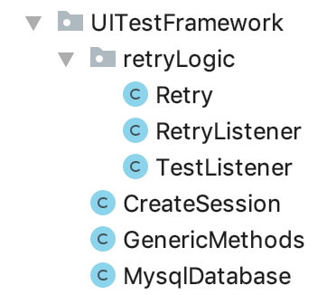

**retryLogic** : It has classes to implement retry in case of failure of a test. Retry count  is set to 1 as of now. Test will be run once if it fails during the execution. 

Add below listener to testng.xml file to include retry functionality.

**CreateSession.java** : All the methods to create a new session and destroy the session after the test(s) execution is over. Each test extends this class. Below are the methods in CreateSession class in their execution order.

1. invokeAppium() - method starts Appium server. Calls startAppiumServer method to start the session depending upon your OS.

2. createDriver(String invokeDriver) - method creates the driver depending upon the passed parameter (android or iOS) and loads the properties files (config and test data properties files).

3. Tests execution (tests are present in IntegrationTests.tests package)

4. teardown() - method quit the driver after the execution of test(s) 

5. stopAppium() - method to stop Appium server. Calls stopAppiumServer() method to stop session depending upon your OS.

**GenericMethods.java** : It is a common repository for all the  webdriver and appium methods which are called in each helper class. Every new method which is being used in helper classes should be added in this class as well. It is to reduce the duplicate code. Each screen class extends this class. Below are few methods defined in this class:

waitForVisibility(By targetElement) - method to wait for an element to be visible
findElement(By locator) - method to find an element
findElements(By locator) - method to find all the elements of specific locator

**MysqlDatabase.java** : This can be used if any DB values need to be verifiedIt has method to read DB and get data from required table. For more help, read on this link: http://www.vogella.com/tutorials/MySQLJava/article.html

**Package : app** : It contains the app build against which tests would be executed. 

**Package : config** - It contains three files config.properties, android_config.properties and iOS_config.properties.

**config.properties** : Path to android and iOS config files are defined in this file. Other common required values like DB connection information etc. could be written in this file.

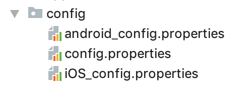

1. android_config.properties - contains the location of the file where test data required by android tests is defined

2. iOS_config.properties - contains the location of the file where test data required by iOS tests is defined

**Package: l10n** : This package contains files having android and iOS test data. It contains two files: en_US_android.properties and en_US_iOS.properties.

1. en_US_android.properties - All test data required by android tests is defined in this file.

2. en_US_iOS.properties - All test data required by iOS tests is defined in this file.

**Package: logger** : It contains Log.java class which contains methods to show the logs on console and save the logs in LogFile.txt of each run.

				
**Package: IntegrationsTests** : This package has sub-packages: screens, helpers, tests.

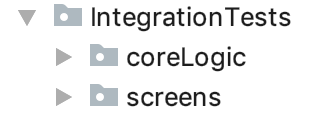

**Package: IntegrationTests.screens** : Classes in this package contains locators which are being used in helpers. Each page in mobile application is mapped to screen. E.g. for android login page, its AndroidLoginScreen. Segregated the locators on the bases of platform: android or iOS

**Package: IntegrationTests.screens.android** : Each screen on andriod app will be having as screen class under this package. It contains all the locators which are visible on that screen. E.g. - AndroidLoginScreen. Each android screen class extends GenericMethods.java. 

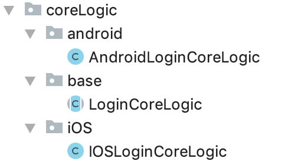

**Package: IntegrationTests.screens.ios** : Each screen on ios app will be having as screen class under this package. It contains all the locators which are visible on that screen. E.g. - IOSLoginScreen etc. Each iOS screen class extends GenericMethods.java. 

**Package: IntegrationTests.phone.helpers** : Classes in this package contains methods which performs intended actions and validations required by a test. Divided the helpers package depending on the platform : android, ios and base
 		
**Package: IntegrationTests.phone.helpers.base** : For each screen there would be corresponding helper. Classes under this package contains abstract methods which are defined in their respective classes in helpers.android and helpers.ios package. Eg: LoginHelper.
				
**Package: IntegrationTests.phone.helpers.android** : For each base helper there would be corresponding android helper (e.g.  - AndroidLoginHelper)
where abstract method declared in base class are defined. Corresponding base class helper will be extended by android helper class. E.g. for LoginHelper base class,  AndroidLoginHelper will extend LoginHelper.
.
**Package: IntegrationTests.phone.helpers.ios** : For each base helper there would be corresponding ios helper (e.g.  - IOSLoginHelper)
where abstract method declared in base class are defined.Corresponding base class helper will be extended by ios helper class. E.g. for LoginHelper base class, IOSLoginHelper will extend LoginHelper.

**Package: IntegrationTests.phone.helpers.tests** :  This package contains all the tests. In each test there is instantiateHelpers(String invokeDriver) method which creates the object at 
runtime of the helper classes required in the test. Object creation happens depending on the platform passed through invokeDriver parameter (android or ios). Then test calls methods defined in the helpers (of which object is created).

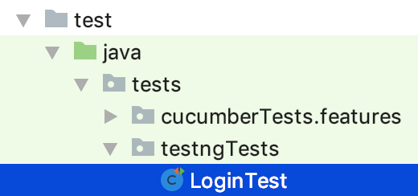

**execute_android_test.xml** : Here you define execution order of your android tests. execute_android_test.xml file name is added as target in build.xml to run android test. 

**execute_iOS_test.xml** : Here you define execution order of your iOS tests. execute_iOS_test.xml file name is added as target in build.xml to run android test. 

###Javadoc of the project can be found in doc folder. It contains information all classes and methods.

#Execution flow of a Test

Below is execution flow with help of login test as example.

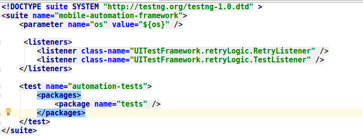

When testng_android.xml file runs, it executes invokeAppium() method (part of CreateSession class in UITestFramework package) present under @BeforeSuite annotation. Right now, it is commented out. You can make changes in these method as per your platform to start appium server programmatically. As of now before running your test, start appium server on your machine

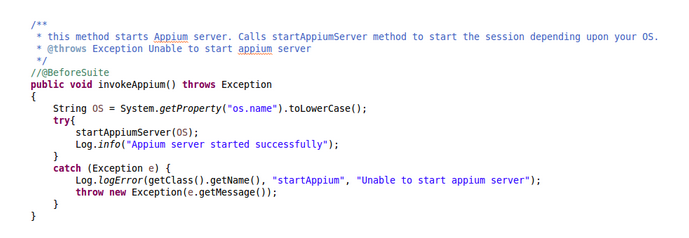

 After this @BeforeMethod annotation is called, createDriver() method is present under this which loads log4.properties file (used by Log.java for logging purpose). It also load all the required property/config files having test data . First config.properties is loaded and then corresponding to the platform android or iOS, test data fies are loaded.  (For eg: for android, android_config.properties and en_US_android.properties files are loaded ) And creates android or iOS driver instance (depending on the platform name passed).

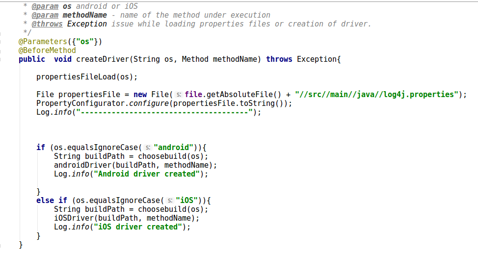

Next comes “instantiateHelpers” group. It would be present in every test under @BeforeMethod annotation. It creates object of all the helper classes (depends on platform ios/android) which is required by test to run that test. Object is used to access all the methods present in helpers. In this case, we are creating object of AndroidLoginHelper class which has methods to login.

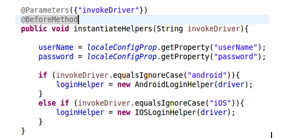

Next @Test Method is executed. Here, we are calling the methods which is required to verify login flow present in AndroidLoginHelper class using loginhelper object. And loading required test data from en_US_android_config.properties/en_US_iOS_config.properties.

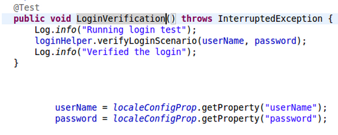

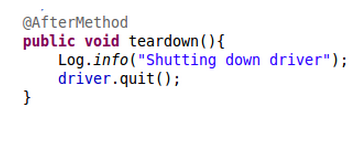

Once tests execution is completed. @AfterMethod annotation (present in CreateSession class) is executed to quit the driver.

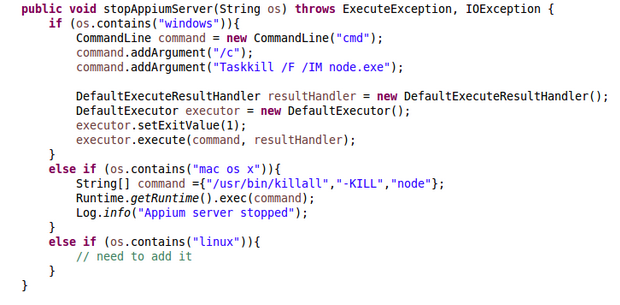

@AfterSuite will be called if it is not commented. It is to stop appium server.

Corresponding helpers and screens files should be added in same hierarchy. Example for LoginTest. LoginHelper would be under base->LoginHelper. 

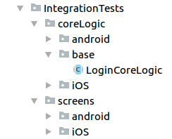

AndroidLoginHelper would be under android->AndroidLoginHelper. 

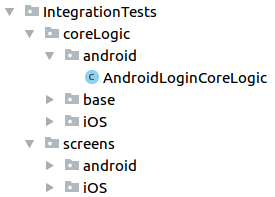

IOSLoginHelper would be under iOS -> IOSLoginHelper. 

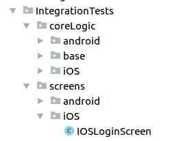

Similar thing should be done for element locators. There is no base folder in case of screens.For android locators, it would be under screens->android->AndroidLoginScreen. 
For iOS locators,  it would be under screens->ios->IOSLoginScreen. 

#How to execute a test

Ant is used as build tool (can be downloaded from here). build.xml file is present in base directory and have targets to android and iOS Test.

Connect your device to your machine or start the emulator.

*Note: start appium server on your machine if not included programatically*

######Run below commands to execute android test:

$ cd UIAutomation/
$ ant executeAndroidTest 

*Include iOS app on which you want to run test. Provide its path in config.xml file (iOSAppPath=src/app/path-to-your-iOSfile). And write  screen locators in IOSLoginScreen and methods in IOSLoginHelper. Now you are ready to run below commands.*

######Run below commands to execute iOS test:

$ cd UIAutomation/
$ ant executeiOSTest 

